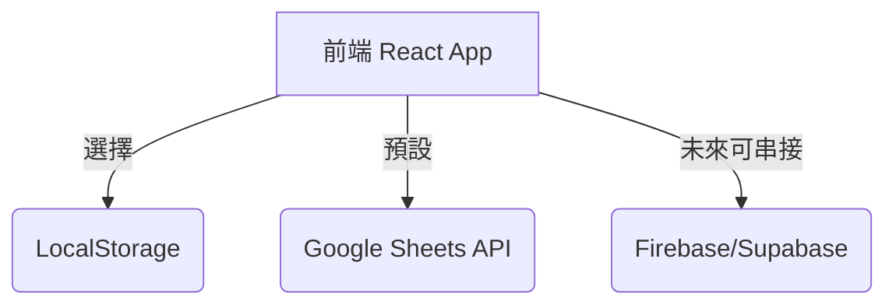

# 資料儲存與成績紀錄架構

## 🎯 目標
- 部署在 GitHub Pages（純前端）
- 仍需紀錄每位作答者的成績
- 保留未來進階方案（LocalStorage 匯出 + Firebase 雲端）

---

## 目前實作：方案 3 — Google Sheets API

```
使用者 → GitHub Pages 前端
             │
             ▼
      Google Sheets API
             │
             ▼
      Google 試算表 (成績資料庫)
```

### 建置步驟
1. **建立 Google Cloud 專案**
   - 進入 https://console.cloud.google.com 建立專案（例如 Backend Quiz System）
2. **啟用 Google Sheets API**
   - API 與服務 → 啟用 API → 搜尋 Google Sheets API → 啟用
3. **建立 API 金鑰**
   - 憑證 → 建立憑證 → API 金鑰
   - 限制：HTTP referer（`https://<user>.github.io/*`）+ API 限制（只允許 Sheets API）
4. **建立試算表**
  - 新建「Backend Quiz Records」或沿用既有表格
  - 記下 Spreadsheet ID（網址中 `/d/` 與 `/edit` 中間）
  - 欄位：Timestamp、Name、Email、TotalScore、MaxScore、Percentage、Architecture、Performance、Reliability、Data
  - ✅ 已提供的表格：`https://docs.google.com/spreadsheets/d/1m_ibL4JPHiYLbfL3MNzlbXKDTVOzuDlgkf3AbNxAyLI/edit?gid=0`
    - **Spreadsheet ID**：`1m_ibL4JPHiYLbfL3MNzlbXKDTVOzuDlgkf3AbNxAyLI`
    - **預設工作表 (gid=0)**：`Sheet1`（可改名，記得同步更新 `VITE_SHEETS_RANGE`）
    - 目前共用設定：**知道連結即可編輯**，使用上最省設定，但請確保僅分享給信任對象。
5. **設定環境變數**
   - `.env`：
     ```bash
     VITE_SHEETS_API_KEY=<Your API Key>
     VITE_SHEETS_SHEET_ID=1m_ibL4JPHiYLbfL3MNzlbXKDTVOzuDlgkf3AbNxAyLI
     VITE_SHEETS_RANGE=Sheet1!A:O   # 如果工作表重新命名請同步更新
     ```
6. **前端流程**
   - 完成測驗 → 呼叫 `recordManager.save()` → 透過 fetch POST 到 Google Apps Script Endpoint 或 Sheets API → 寫入試算表

---

## 未來擴充路線

### 方案 1：LocalStorage + 匯出
- 目的：使用者自行保存紀錄，無外傳
- 功能：
  - localStorage 保存所有答題紀錄
  - UI 提供 JSON/CSV 匯出按鈕
  - 可選的匯入功能（重新載入舊紀錄）
- 適合：個人練習或無法上傳資料的情境

### 方案 4：Firebase / Supabase（雲端資料庫）
- 目的：完整的後端持久層與管理功能
- 功能：
  - 使用者認證（Email/匿名）
  - Firestore/Supabase 寫入每次作答
  - 即時排行榜、歷史查詢
  - 後台審查或人工批改
- 優勢：擴展性高、權限管控細緻
- 成本：入門免費額度足夠，之後依使用量付費

### 混合架構（保留彈性）

- `RecordManager` 介面統一：
  ```ts
  interface RecordManager {
    save(record: TestRecord): Promise<void>;
    list(): Promise<TestRecord[]>;
    export(format: 'json'|'csv'): void;
  }
  ```
- 目前 default 實作：`GoogleSheetsRecordManager`
- 未來可加入：`LocalRecordManager`、`FirebaseRecordManager`

---

## 成本 & 限制
- Google Sheets API 免費額度：每日 500 次讀取 / 300 次寫入
- GitHub Pages 流量：每月 100GB 免費
- 不需自行維護伺服器

---

## 安全性注意事項
1. API Key 只允許 GitHub Pages 網域
2. 試算表權限只開放給管理員（或使用 Apps Script Webhook）
3. 若採用「知道連結即可編輯」的權限，務必提醒團隊該試算表屬開放狀態
4. 遵循個資保護：提供「是否願意上傳成績」選項；允許匿名測驗

---

## 後續 TODO
- [ ] 完成 Google Apps Script webhook / 直接呼叫 Sheets API 的程式碼
- [ ] UI 增加「匯出紀錄」功能（JSON/CSV）
- [ ] 若需 Firebase：補上 Cloud Functions＋Firestore 架構
